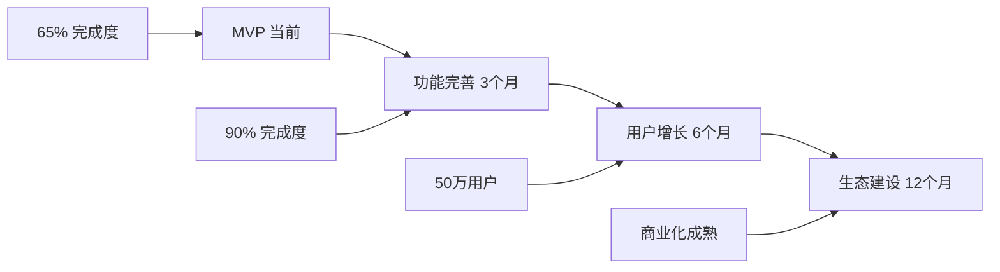

# RandomLife 项目文档目录

欢迎使用 RandomLife 项目文档！这里包含了项目的完整分析、开发方案和商业计划。

## 📚 文档目录

### 1. [项目功能总结](./项目功能总结.md)
**详细分析项目当前状态和功能实现**

- 项目概述和技术架构
- 已完成功能清单 ✅
- 未完成功能分析 ❌
- 优势和挑战评估
- 总体完成度评估 (当前65%)

### 2. [10天开发方案](./10天开发方案.md)
**将项目从MVP提升至可上线状态的详细开发计划**

- 每日开发任务分解
- 关键功能实现时间表
- 技术实施细节
- 风险控制措施
- 预期成果 (目标90%+完成度)

### 3. [技术架构分析](./技术架构分析.md)
**深度技术架构分析和优化建议**

- 前端架构设计 (Next.js + React)
- 后端API架构 (RESTful + NextAuth)
- 数据库设计 (Prisma + SQLite)
- 性能优化策略
- 安全性分析
- 扩展性评估

### 4. [商业计划书](./商业计划书.md)
**完整的商业化策略和市场分析**

- 市场规模和竞争分析
- 产品策略和路线图
- 商业模式和盈利预测
- 市场营销策略
- 团队建设计划
- 风险分析和应对
- 融资计划

## 🚀 快速开始

### 查看项目状态
如果你想知道项目当前的完成情况，建议先阅读：
1. [项目功能总结](./项目功能总结.md) - 了解现状
2. [10天开发方案](./10天开发方案.md) - 了解如何完善

### 开发实施
如果你准备开始开发，建议按顺序阅读：
1. [项目功能总结](./项目功能总结.md) - 了解技术架构
2. [10天开发方案](./10天开发方案.md) - 跟随开发计划
3. [技术架构分析](./技术架构分析.md) - 深入技术细节

### 商业化准备
如果你关注项目的商业化，建议阅读：
1. [商业计划书](./商业计划书.md) - 完整商业策略
2. [项目功能总结](./项目功能总结.md) - 了解产品优势

## 📋 项目概要

### 当前状态
- **开发进度**: 65% 完成
- **核心功能**: 基本实现
- **技术栈**: Next.js 14 + React 18 + TypeScript + Prisma
- **主要缺失**: 真实支付系统、AI推荐算法、数据持久化

### 商业潜力
- **目标市场**: 18-45岁都市人群
- **商业模式**: 订阅制 (免费版 + Pro版 + 企业版)
- **预期收入**: 第3年达到¥7192万年收入
- **竞争优势**: 一键推荐 + 多场景覆盖 + AI个性化

### 发展规划
- **近期目标** (10天): 达到90%+完成度，可上线状态
- **中期目标** (6个月): 用户50万，商业化验证
- **长期目标** (3年): 用户200万，成为行业领导者

## 🔧 技术栈总览

```typescript
// 前端技术栈
Frontend: {
  framework: "Next.js 14 (App Router)",
  ui: "React 18 + TypeScript",
  styling: "Tailwind CSS + shadcn/ui",
  animation: "Framer Motion",
  state: "React Hooks + NextAuth"
}

// 后端技术栈
Backend: {
  api: "Next.js API Routes",
  auth: "NextAuth.js (Credentials)",
  database: "SQLite + Prisma ORM",
  payment: "Stripe SDK + PayPal SDK",
  ai: "OpenAI API (计划)"
}

// 部署和工具
Deployment: {
  platform: "Vercel (推荐) / AWS",
  monitoring: "计划集成",
  testing: "Jest + Cypress (计划)",
  ci_cd: "GitHub Actions (计划)"
}
```

## 📊 关键指标

### 技术指标
- **代码质量**: ⭐⭐⭐⭐⭐ (TypeScript + 现代化工具链)
- **性能表现**: ⭐⭐⭐⭐ (基础优化完成，有提升空间)
- **安全性**: ⭐⭐⭐⭐ (基础安全措施完善)
- **可维护性**: ⭐⭐⭐⭐⭐ (模块化设计，代码结构清晰)

### 商业指标
- **市场规模**: ⭐⭐⭐⭐⭐ (千亿级决策辅助市场)
- **用户需求**: ⭐⭐⭐⭐⭐ (选择困难是普遍痛点)
- **商业模式**: ⭐⭐⭐⭐ (订阅制清晰，有收入预期)
- **竞争环境**: ⭐⭐⭐ (有竞争，但差异化明显)

## 🎯 核心优势

### 产品优势
1. **创新交互**: "摇一摇"降低决策门槛
2. **多场景覆盖**: 娱乐、购物、美食、出行、健身一体化
3. **AI个性化**: 基于用户行为的智能推荐
4. **订阅制模式**: 持续收入，用户粘性高

### 技术优势
1. **现代化架构**: Next.js 14 + TypeScript，可扩展性好
2. **类型安全**: 完整的TypeScript支持，减少bug
3. **组件化设计**: shadcn/ui组件库，开发效率高
4. **响应式设计**: 移动优先，适配各种设备

### 商业优势
1. **清晰定位**: 专注决策困难场景
2. **多元收入**: 订阅 + 增值服务 + 数据服务
3. **网络效应**: 用户越多，推荐越精准
4. **可扩展性**: 可扩展到更多生活场景

## 📈 发展路线图



## 🔗 重要链接

### 项目相关
- **GitHub Repository**: (项目代码库)
- **演示地址**: (在线演示)
- **API文档**: (API接口文档)

### 外部资源
- **Next.js官方文档**: https://nextjs.org/docs
- **Prisma文档**: https://www.prisma.io/docs
- **shadcn/ui**: https://ui.shadcn.com/
- **Stripe文档**: https://stripe.com/docs

## 📞 联系信息

如有任何关于项目的问题或建议，请通过以下方式联系：

- **项目团队**: RandomLife开发团队
- **技术支持**: 技术问题咨询
- **商务合作**: 商业合作洽谈

---

**最后更新**: 2025年11月28日
**文档版本**: v1.0
**项目状态**: 开发中 (65%完成)

---

💡 **提示**: 建议按照文档顺序阅读，先了解项目现状，再制定开发计划，最后关注商业策略。这样可以获得最全面的项目理解。